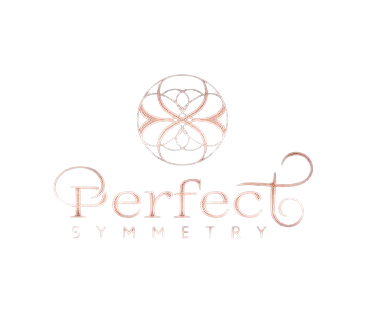
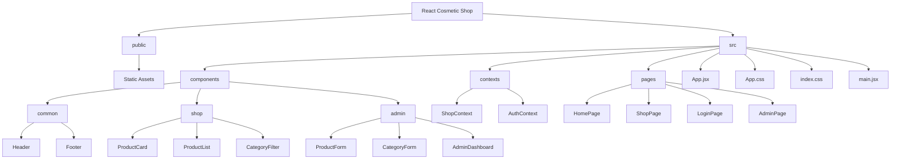
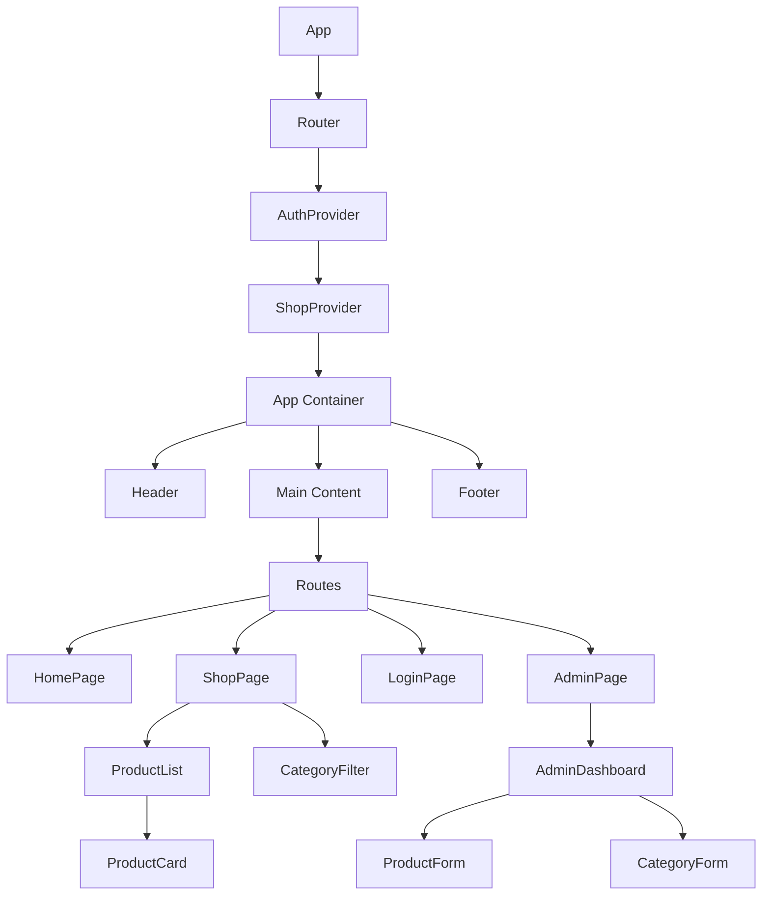
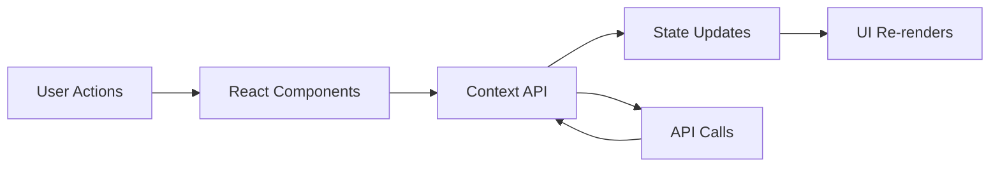

# Perfect Symmetry - React Cosmetic Shop

[](https://reactjs.org/)
[](https://vitejs.dev/)
[](https://opensource.org/licenses/MIT)
[](http://makeapullrequest.com)

A modern, tablet-style e-commerce application for a cosmetic shop built with React.



## 🌟 Features

- **Tablet-Style Interface**: Unique floating tablet design with hardware buttons
- **Responsive Design**: Adapts to different screen sizes
- **Product Catalog**: Browse and filter products by category
- **Admin Dashboard**: Manage products, categories, and inventory
- **User Authentication**: Secure login for administrators
- **Modern UI**: Clean, intuitive interface with smooth animations

## 🛠️ Tech Stack

- **Frontend**: React, React Router, Context API
- **Styling**: CSS with custom variables for theming
- **State Management**: React Context for global state
- **Authentication**: Custom authentication system

## 🚀 Getting Started

### Prerequisites

- Node.js (v14 or higher)
- npm or yarn

### Installation

1. Clone the repository:
   ```
   git clone https://github.com/yourusername/react-cosmetic-shop.git
   cd react-cosmetic-shop
   ```

2. Install dependencies:
   ```
   npm install
   ```

3. Start the development server:
   ```
   npm run dev
   ```

4. Open your browser and navigate to `http://localhost:5173`

## 📁 Project Structure

```
react-cosmetic-shop/
├── public/                 # Static assets
├── src/
│   ├── components/         # Reusable UI components
│   │   ├── common/         # Shared components (Header, Footer)
│   │   ├── shop/           # Shop-specific components
│   │   └── admin/          # Admin dashboard components
│   ├── contexts/           # React Context providers
│   ├── pages/              # Page components
│   ├── App.jsx             # Main application component
│   ├── App.css             # Main styles
│   ├── index.css           # Global styles
│   └── main.jsx            # Application entry point
└── package.json            # Project dependencies
```

### Project Structure Diagram



### Component Hierarchy



### Data Flow



## 🎨 Design Features

- **Tablet Interface**: The application is designed to look like a tablet device with:
  - Rounded corners (20px border-radius)
  - Box shadow for floating effect
  - Power button on the right side
  - Volume up and down buttons on the left side
  - Responsive sizing (70% width normally, 80% for medium screens, 95% for small screens)

- **Color Scheme**: Dark theme with:
  - Primary color: #bb86fc (purple)
  - Secondary color: #03dac6 (teal)
  - Background: #121212 (dark gray)
  - Surface: #1e1e1e (slightly lighter gray)
  - Error: #cf6679 (pink)

## 👩‍💼 Admin Access

To access the admin dashboard:

1. Navigate to the login page
2. Use the following credentials:
   - Username: admin
   - Password: password123

## 🤝 Contributing

Contributions are what make the open source community such an amazing place to learn, inspire, and create. Any contributions you make are **greatly appreciated**.

1. Fork the Project
2. Create your Feature Branch (`git checkout -b feature/AmazingFeature`)
3. Commit your Changes (`git commit -m 'Add some AmazingFeature'`)
4. Push to the Branch (`git push origin feature/AmazingFeature`)
5. Open a Pull Request

## 📝 License

This project is licensed under the MIT License - see the [LICENSE](LICENSE) file for details.

## 🙏 Acknowledgments

- Design inspired by modern tablet interfaces
- Icons from [Material Icons](https://fonts.google.com/icons)
- Color scheme based on Material Design dark theme


## ⭐️ Show your support

Give a ⭐️ if this project helped you!
